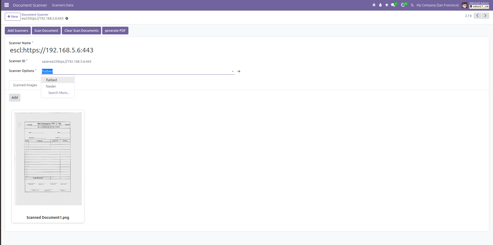
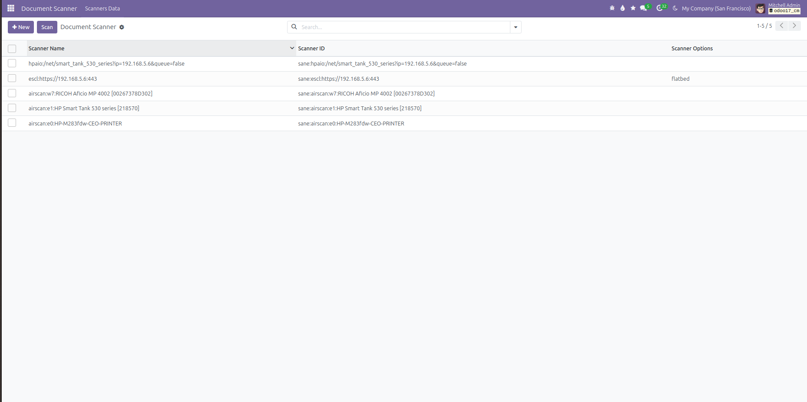

# Scanner Integration in Odoo

## Overview

This project implements seamless scanner integration within the Odoo platform, allowing users to perform scanning operations directly from Odoo. Users can select a scanner connected to their network, configure scanning options like flatbed, feeder, or other functionalities supported by the scanner (e.g., HP, Canon, Ricoh devices), and initiate scans effortlessly.

## Key Features

### 1. Scanner Selection
- Users can choose any network-connected scanner for operations.

### 2. Customizable Options
- Configure scanning preferences, such as flatbed or feeder, directly from Odoo.

### 3. PDF Generation
- Scanned documents can be processed and downloaded as PDFs with a single click.

## Technologies Used
- Developed using OWL.js framework, Python, Linux, and XML for robust and efficient integration.

## Outcome
This solution enhances productivity by integrating hardware capabilities into Odoo, providing a streamlined and user-friendly experience.

## Demo
To see the scanner integration in action, follow these steps:
1. Navigate to the Scanner module in Odoo.
2. Select a connected scanner from the available list.
3. Configure scanning preferences (flatbed, feeder, etc.).
4. Initiate the scan and view/download the scanned document.

## Contact
**📧 Email: [burnaviour7890@gmail.com](mailto:burnaviour7890@gmail.com)**

**🔗 LinkedIn: [Muhammad Muzafar](https://www.linkedin.com/in/muhammad-muzafar-78147b213/)**

